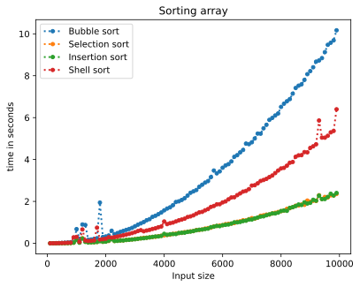
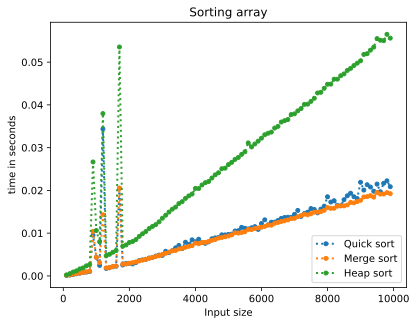

# Sort algorithms

## install depencies

```bash
pip install -r requirements.txt
```

## Run tests

```
python -m unittest discover -s tests -p "*_test.py"
```

## Run benchmark

```bash
python benchmark.py
```

## plot benchmark graphs

```bash
python plot_benchmark.py
```

## Graphs

  
**Slow algorithms**

  
**Fast algorithms**
